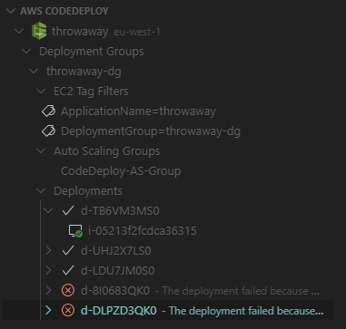
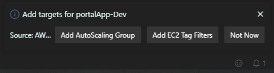

# AWS CodeDeploy VS Code Extension

 

AWS CodeDeploy extension for VS Code

## Features
- Link AWS CodeDeploy Application to vscode workspace and view/manage application.

    
    
- Create CodeDeploy Application and/ Deployment Groups.
- Deploy to CodeDeploy from a vscode Workspace using S3 revision locations.

## Installation
1. Install aws-cli and [configure credentials](https://docs.aws.amazon.com/cli/latest/userguide/cli-chap-configure.html). Alternatively setup AWS Credentials from [Environment Variables](https://docs.aws.amazon.com/sdk-for-javascript/v2/developer-guide/loading-node-credentials-environment.html)
2. Install [AWS CodeDeploy vscode extension](https://marketplace.visualstudio.com/items?itemName=mziyabo.vscode-codedeploy)

## Quick Start

### To get setup with the extension perform the following tasks:

> Note: the following steps assume that you have a workspace already open.

1. Open the Explorer  in the Activity Bar and then click the `AWS CodeDeploy` view.
2. Choose either `Create Application` or `Add Existing Application` to associate a CodeDeploy application with your workspace. 
3. Follow the on-screen prompts to add Application and Deployment Group.

Click `Add AutoScaling Group` or `Add EC2 Tag Filter` in the notification window to associate the application with EC2 Targets

4. Right click a deployment group and choose `Deploy Application` to create deployment to targets from the vscode workspace.

 > Note to remove the workspace link to the CodeDeploy application run `AWS CodeDeploy: Unlink Workspace` from the Command Palette or the CodeDeploy Explorer.

## Extension Limitations
- Limited to CodeDeploy to EC2
- Supports S3 revision locations- GitHub currently not available 

## Release Notes
This extension is still in preview and open to contribution.

## Licence
[Apache-2.0](./LICENSE)